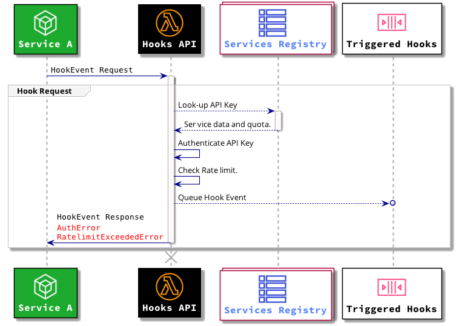
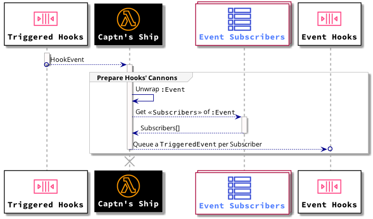
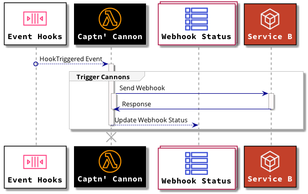

# Captn' Hook Architecture

Captn' Hook is a Webhooks service that allows asynchronous Service-to-Service Communication.

## Webhooks

Webhooks are a way for a service to provide information about the events that happen to external services in real-time.
 
Webhooks are user-defined callbacks which are triggered by specific events. When the event triggers the webhook 
will send the callback to all its subscribers with the data of the event.

## Captn' Hook Components

### Hook API

The Hook API allows basic operations on Captn' Hook:

- Register a Service to get an API Key.
- Create an Event for a specific service.
- Add a Subscriber to an Event.
- Trigger an Event of a specific service.

### λ Ship 

The Ship module receives events from the Hooks Queue, and loads the events into the cannons for webhook delivery.

### λ Cannons

The Cannons are the workers that send the webhooks to the subscribed services. Cannons will retry three times when 
they miss their target. After that they will mark the webhook as a failure.

### λ Mr. Smee

Smee, being the _bo's'n_ of the ship. Counts the number of events and webhooks triggered by a service, updating the services'
API usage, enabling the Hook API to handle rate limiting on the API.

## TODO

After basic functionality, the following items will be added:

- **Subscriber verification**: Services will need to provide subscriber verification via hash file or DNS record.
- **Service usage statistics**: Stats of the events generated by each service.  
- **Event Log Streaming**: Cross service Event Log that other services can subscribe to.
- Subscriber health check reporting.
- Service usage metering.
